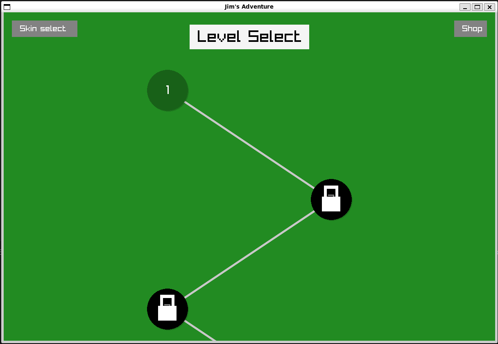
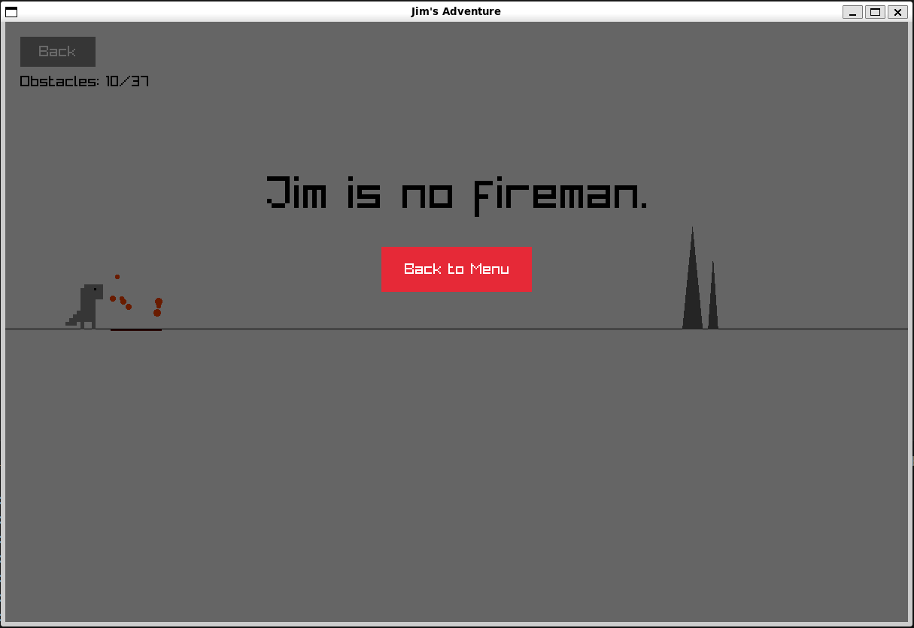

# Jim's Adventure: Heavilly Modded Dino Game

## Description
Jim is heavilly modded dino game inspired by Chrome's dino game, implemented in ocaml. In this game, you can complete 12 levels each with increasing difficulty and enjoy 4 different biomes along the way. The shop system allows you to customize Jim with skins and customize your running experience. We also included a storyline and progress saving so you can help Jim get back to his family!
## Features
- Shop and coin functionality
- Skins and chest purchasing
- Multiple biomes with custom death messages
- Increasing difficulty
- Persistent game progress saving

## Screenshots

### Main Menu


### Gameplay



### Character Customization


### Gameplay




## Installation
```b
# This game requires ocaml and dune (Windows use WSL)
opam install raylib
dune build
dune exec bin/main.exe
```

## Controls
- Space/Up arrow - Jump


## Technologies Used
- Programming Language: Ocaml
- Additional Libraries: Raylib, Dune

## Credits
Developed by [Jim's Crew] 2024
- Joshua Dirga
- Evan Navar Root
- George Margono
